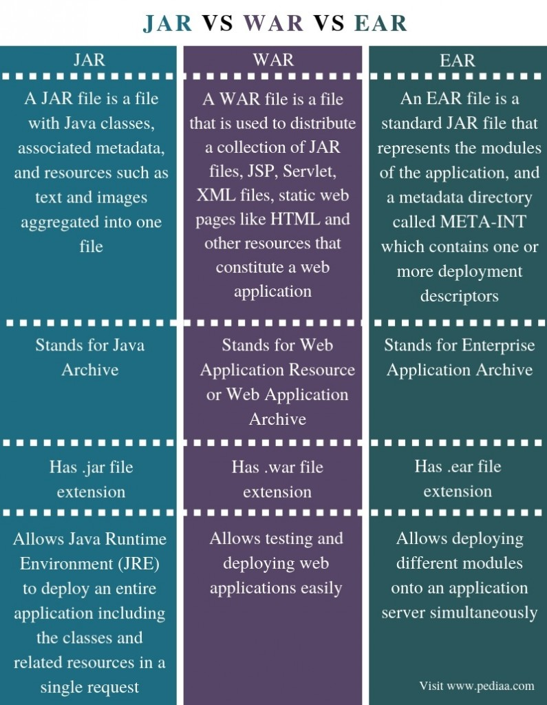
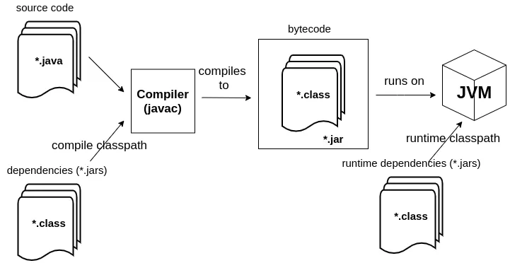
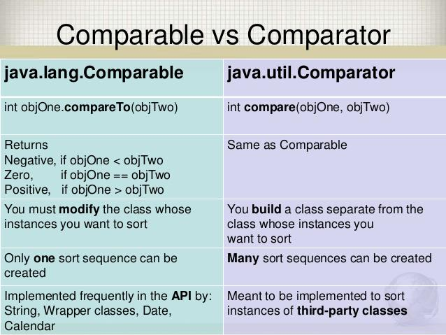
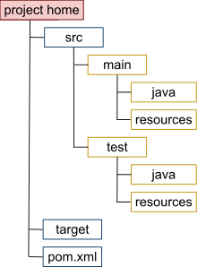
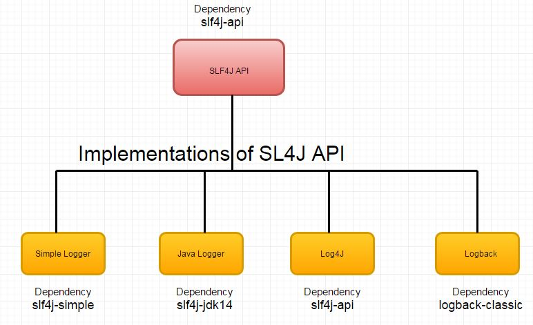
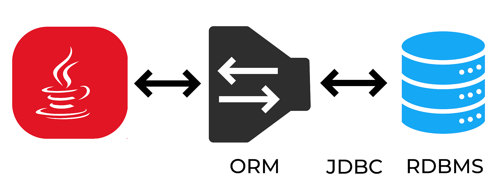
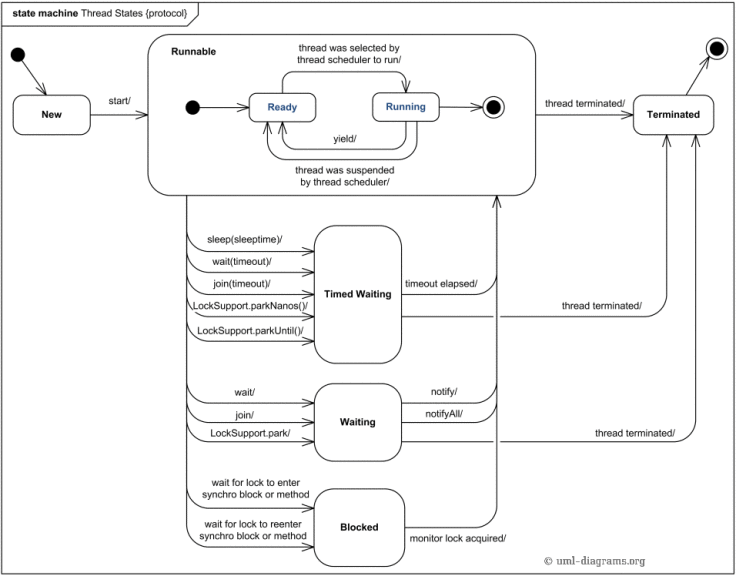

# Transition .NET Framework to Java developer guide

Write once, run anywhere (c)
## How to use
<!-- TOC -->
- [Preparation](#preparation)
- [Ecosystem overview](#ecosystem-overview)
- [Build tools](#build-tools)
  - [Maven](#maven)
- [Basics](#basics)
- [Core](#core)
    - [Objects equality](#objects-equality)
    - [Exceptions](#exceptions)
    - [Collections](#collections)
    - [Generics](#generics)
    - [Annotations](#annotations)
    - [Stream API vs LINQ](#stream-api-vs-linq)
    - [Optional](#optional)
    - [Date time](#datetime)
- [First console application](#first-console-application)
- [Unit testing](#unit-testing)
- [Logging](#logging)
- [Web](#web)
  - [Spring](#spring)
    - [Spring vs ASP .NET Framework](#spring-vs-asp-net-framework)
    - [Spring boot and starters](#spring-boot-and-starters)
    - [First web application](#first-web-application)
    - [12 factor](#12-factor)
    - [Template language](#template-language)
    - [Observability](#observability)
- [ORM](#orm)
  - [JDBC](#jdbc)
  - [JPA](#jpa)
  - [Hibernate](#hibernate)
    - [Entity states](#entity-states)
    - [N+1 problem](#n+1)
- [Utils](#utils)
  - [Objects mapping](#objects-mapping)
  - [Lombok](#lombok)
- [Advanced](#advanced)
  - [Concurrency](#concurrency)
  - [Troubleshooting](#troubleshooting)
  - [Architecture](#architecture)
<!-- TOC -->

### Preparation
Download and install required tools and software
   1. [Java 11.0.2 (build 11.0.2+9)](https://jdk.java.net/archive/)
      1. Set up JAVA_HOME and add Java bin to path [for Windows](https://www.ibm.com/docs/en/b2b-integrator/5.2?topic=installation-setting-java-variables-in-windows) [for Mac](https://gist.github.com/fabianogoes/bf7aa20b007d8dda1ed2)
      2. Verify. Result of `echo %JAVA_HOME%`(Windows, for Mac use `echo $JAVA_HOME`) `java --version` should be something like this
         ```
         C:\Users\user>echo %JAVA_HOME%
         C:\workspace\soft\jdk-11.0.13+8
         
         C:\Users\ychum>java --version
         openjdk 11.0.13 2021-10-19
         OpenJDK Runtime Environment Temurin-11.0.13+8 (build 11.0.13+8)
         OpenJDK 64-Bit Server VM Temurin-11.0.13+8 (build 11.0.13+8, mixed mode)
         ```
         
   2. [Download and install Maven](https://maven.apache.org/install.html)
      1. Verify. Result of `mvn --version` should be something like this
         ```
         C:\Users\user>mvn --version
         Apache Maven 3.6.3 (cecedd343002696d0abb50b32b541b8a6ba2883f)
         Maven home: c:\workspace\soft\apache-maven-3.6.3\bin\..
         Java version: 11.0.13, vendor: Eclipse Adoptium, runtime: C:\workspace\soft\jdk-11.0.13+8
         Default locale: en_US, platform encoding: Cp1252
         OS name: "windows 10", version: "10.0", arch: "amd64", family: "windows"
         ```
   3. [Java IDE IntelliJ IDEA Community edition](https://www.jetbrains.com/idea/download). [Set up Intellij Idea to use your Java](https://www.jetbrains.com/help/idea/sdk.html#set-up-jdk)

### Ecosystem overview

Java platform


Comparison with .NET Framework


More info about JVM
 - [Classloader subsystem](https://docs.oracle.com/en/java/javase/11/docs/api/java.base/java/lang/ClassLoader.html)
 - [JVM architecture](https://www.oracle.com/webfolder/technetwork/tutorials/obe/java/gc01/index.html) 
 - [Spec](https://docs.oracle.com/javase/specs/jvms/se11/html/jvms-2.html)

[Release cycle](https://www.infoq.com/news/2017/09/Java6Month/)

[Most commonly available JDKs](https://blog.frankel.ch/common-jdks/)

[Difference between OpenJDK and Adoptium/AdoptOpenJDK](https://stackoverflow.com/questions/52431764/difference-between-openjdk-and-adoptium-adoptopenjdk)

### Build tools

Building results


The diagram below depicts building and running Java archive (jar)



[Build tools overview](https://www.jrebel.com/blog/java-build-tools-comparison)

#### Maven
[Getting Started in 5 Minutes](https://maven.apache.org/guides/getting-started/maven-in-five-minutes.html)

[Getting Started in 30 Minutes](https://maven.apache.org/guides/getting-started/index.html)

[Lifecycles](https://maven.apache.org/guides/introduction/introduction-to-the-lifecycle.html)

### Basics
[Language basics](https://docs.oracle.com/javase/tutorial/java/nutsandbolts/index.html)

[Oracle code conventions](https://www.oracle.com/java/technologies/javase/codeconventions-introduction.html)

[Google Java Style Guide](https://google.github.io/styleguide/javaguide.html)

[Object](https://docs.oracle.com/javase/tutorial/java/concepts/object.html)

[Object methods](https://docs.oracle.com/javase/tutorial/java/IandI/objectclass.html)

### Core
Recommended books
- [Effective Java](https://www.amazon.com/Effective-Java-Joshua-Bloch-dp-0134685997/dp/0134685997/ref=dp_ob_image_bk)
- [Modern Java in action](https://www.manning.com/books/modern-java-in-action)

[Tutorial](https://www.digitalocean.com/community/tutorials/core-java-tutorial)
[Java language updates](https://docs.oracle.com/en/java/javase/19/language/java-language-changes.html)
#### Objects equality
[Equals and hashcode](https://www.digitalocean.com/community/tutorials/java-equals-hashcode)



#### Exceptions


[Tutorial](https://docs.oracle.com/javase/tutorial/essential/exceptions/index.html)

#### Collections

[Tutorial](https://docs.oracle.com/javase/tutorial/collections/interfaces/index.html)

#### Generics
[Tutorial](https://docs.oracle.com/javase/tutorial/extra/generics/intro.html)

#### Stream API vs LINQ
[Comparison](https://www.iodigital.com/en/history/foreach/java-and-net-comparing-streams-linq)

Stream API [#1](https://www.oracle.com/technical-resources/articles/java/ma14-java-se-8-streams.html) [#2](https://www.oracle.com/technical-resources/articles/java/architect-streams-pt2.html) 

[Optional](https://www.oracle.com/technical-resources/articles/java/java8-optional.html)

[Date time](https://docs.oracle.com/javase/tutorial/datetime/iso/overview.html)

#### Annotations
[Tutorial](https://docs.oracle.com/javase/tutorial/java/annotations/)

### First console application
Maven project structure, detailed [see](https://maven.apache.org/guides/introduction/introduction-to-the-standard-directory-layout.html)

[Intellij IDEA | Creating a Maven project](https://www.jetbrains.com/idea/guide/tutorials/working-with-maven/creating-a-project/) 



`dotnet2java\java\console-app\src\main\java\com\mycompany\app\HelloWorldApp.java`
```java
public class HelloWorldApp {

  public static void main(String[] args) {
    System.out.println("Hello World!");
  }
}
```
How to run
1. [IntelliJ IDEA](https://www.jetbrains.com/help/idea/delegate-build-and-run-actions-to-maven.html) 
2. Console
   1. Make sure that you are in `console-app` folder
       ```
       $ pwd
       /code/dotnet2java/java/console-app
       ```
   2. Run maven to build jar 
      ```
      mvn clean package
      ```

   3. Run Java program
       ```
       java -cp  ./target/console-app-1.0-SNAPSHOT.jar com.mycompany.app.HelloWorldApp
       ```

[A Closer Look at the "Hello World!" Application](https://docs.oracle.com/javase/tutorial/getStarted/application/index.html)
### Unit testing
 - [JUnit - testing framework](https://junit.org/junit5/)
   - [Tutorial](https://www.digitalocean.com/community/tutorials/junit5-tutorial)
 - [Mockito - mocking framework](https://site.mockito.org/) 
   - [Tutorial](https://www.digitalocean.com/community/tutorials/mockito-tutorial)

Usually, JUnit is usually used in conjunction with Mockito. Alternative testing framework is [TestNG](https://testng.org/doc/).
[Powermock](https://github.com/powermock/powermock) as mocking extension for Mockito or [EasyMock](https://github.com/powermock/powermock/wiki/EasyMock) to test private or static methods.

#### Example
Let's imagine we have basic calculator with simple method that adds two integers.

`dotnet2java\java\console-app\src\main\java\com\mycompany\app\BasicCalculator.java`
```java
public class BasicCalculator {

  public int addTwoIntegers(int firstInteger, int secondInteger) {
    return Math.addExact(firstInteger, secondInteger);
  }
}
```

In order to test at least 1 positive and 1 negative scenarios, we can create something like this:
`dotnet2java\java\console-app\src\test\java\com\mycompany\app\BasicCalculatorTest.java`
```java
package com.mycompany.app;

import org.junit.Assert;
import org.junit.Test;

public class BasicCalculatorTest {

  private final BasicCalculator calculator = new BasicCalculator();

  @Test
  public void shouldAddTwoIntegersTest() {
    //given
    int firstInteger = 1;
    int secondInteger = 3;

    //when
    int actual = calculator.addTwoIntegers(firstInteger, secondInteger);

    //then
    int expected = 4;
    Assert.assertEquals(expected, actual);
  }

  @Test(expected = ArithmeticException.class)
  public void shouldThrowArithmeticExceptionInCaseOverflow() {
    //given
    int firstInteger = Integer.MAX_VALUE;
    int secondInteger = Integer.MAX_VALUE / 2;

    //when
    calculator.addTwoIntegers(firstInteger, secondInteger);
  }

}
```

To run tests, make sure that you in the same folder as `pom.xml` and run `mvn clean test`.
After maven execution, you will see:
```
-------------------------------------------------------
 T E S T S
-------------------------------------------------------
Running com.mycompany.app.BasicCalculatorTest
Tests run: 2, Failures: 0, Errors: 0, Skipped: 0, Time elapsed: 0.041 sec

Results :

Tests run: 2, Failures: 0, Errors: 0, Skipped: 0
```

### Logging
[Built in](https://docs.oracle.com/javase/8/docs/technotes/guides/logging/overview.html#a1.0)

[SLF4J as logging facade](https://www.slf4j.org/manual.html) 



[Log4j2](https://logging.apache.org/log4j/2.x/)

[Logback](https://logback.qos.ch/)

### Web
#### Spring
[Spring overview](https://docs.spring.io/spring-framework/docs/3.2.x/spring-framework-reference/html/overview.html)


Main concepts
- [DI & IoC](https://docs.spring.io/spring-framework/docs/3.2.x/spring-framework-reference/html/beans.html#beans-introduction)
- [AOP](https://docs.spring.io/spring-framework/docs/3.2.x/spring-framework-reference/html/aop.html#aop-introduction)
- Beans [scopes](https://docs.spring.io/spring-framework/docs/3.0.0.M3/reference/html/ch04s04.html)
  

##### Spring vs ASP .NET Framework
[Comparison](https://medium.com/@putuprema/spring-boot-vs-asp-net-core-a-showdown-1d38b89c6c2d)

##### Spring boot and starters

[Overview](https://spring.io/projects/spring-boot)

[Article](https://www.ibm.com/topics/java-spring-boot)

#### First web application
TODO

##### 12 factor
[Origin](https://12factor.net/)

[Cloud Native Apps](https://www.infoq.com/presentations/12factor-spring/)

#### Template language
[Mustache](https://spring.io/blog/2016/11/21/the-joy-of-mustache-server-side-templates-for-the-jvm)

[Thymeleaf](https://spring.io/guides/gs/serving-web-content/)

#### Observability

[Zipkin](https://tanzu.vmware.com/developer/guides/spring-zipkin/)

[Jaeger](https://github.com/opentracing-contrib/java-spring-jaeger)

[Application metrics](https://spring.io/blog/2018/03/16/micrometer-spring-boot-2-s-new-application-metrics-collector#what-do-i-get-out-of-the-box)

### ORM


#### JDBC
[What is JDBC?](https://www.infoworld.com/article/3388036/what-is-jdbc-introduction-to-java-database-connectivity.html)

[Tutorial](https://docs.oracle.com/javase/tutorial/jdbc/basics/index.html)

#### JPA
[What is JPA?](https://www.infoworld.com/article/3379043/what-is-jpa-introduction-to-the-java-persistence-api.html)

#### Hibernate
[Recommended blog](https://vladmihalcea.com/blog/)

##### Entity states


[Article](https://vladmihalcea.com/wp-content/uploads/2014/07/jpaentitystates.png)

##### N+1 problem

[Article](https://vladmihalcea.com/a-beginners-guide-to-jpa-hibernate-entity-state-transitions/)

### Utils
#### Objects mapping
[JSON for Java](https://github.com/FasterXML/jackson)

[Jackson tutorial](https://www.digitalocean.com/community/tutorials/jackson-json-java-parser-api-example-tutorial)

[Java bean mappings](https://mapstruct.org/)

#### Lombok
[Project lombok](https://projectlombok.org/) is an annotation-based Java library that allows you to reduce boilerplate code using code generation.
Alternative solution can be [records introduced in Java 14](https://docs.oracle.com/en/java/javase/14/language/records.html).

### Advanced

#### Concurrency


Recommended books
- [Concurrency in Practice](https://www.amazon.com/Java-Concurrency-Practice-Brian-Goetz/dp/0321349601)



[Tutorial](https://docs.oracle.com/javase/tutorial/essential/concurrency/index.html)

[JLS Chapter 17](https://docs.oracle.com/javase/specs/jls/se11/html/jls-17.html)

#### Troubleshooting
[Guide](https://docs.oracle.com/en/java/javase/11/troubleshoot/index.html)

[VM Options](https://www.oracle.com/java/technologies/javase/vmoptions-jsp.html)

#### Architecture
Recommended books
 - [Get Your Hands Dirty on Clean Architecture](https://leanpub.com/get-your-hands-dirty-on-clean-architecture)
 - [Domain-Driven Design Distilled ](https://www.amazon.com/Domain-Driven-Design-Distilled-Vaughn-Vernon/dp/0134434420)
 - [Clean Architecture: A Craftsman's Guide to Software Structure and Design](https://www.amazon.com/Clean-Architecture-Craftsmans-Software-Structure/dp/0134494164)