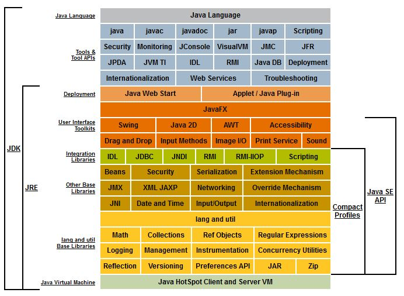
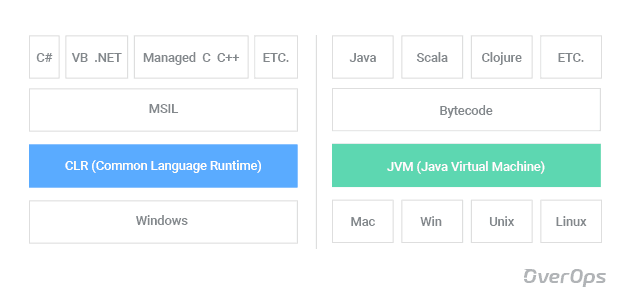

# Transition .NET to Java developer guide
## How to use
<!-- TOC -->
- [Preparation](#preparation)
- [Ecosystem overview](#ecosystem-overview)
- [Build tools](#build-tool)
- [Syntax & Style](#syntax-style)
- [Core](#core)
- [First console application](#first-app)
  - [Unit testing](#unit-testing)
- [Web](#web)
  - [Spring](#web-spring)
    - [Spring boot and starters](#web-spring-boot)
  - [ORM](#web-orm)
    - [Hibernate](#web-orm-hibernate)
  - [Template language](#web-template-lang)
  - [First web application](#web-first-app)
  - [DTO vs Entity mapping](#web-dto-entity-mapping)
- [Hexagonal architecture](#hexagonal-architecture)
- [Memory model](#memory-model)
- [Concurrency](#concurrency)
- [Troubleshooting](#troubleshooting)
<!-- TOC -->

### Preparation
Download and install required tools and software
   1. [Java 11.0.2 (build 11.0.2+9)](https://jdk.java.net/archive/)
      1. Set up JAVA_HOME and add Java bin to path [for Windows](https://www.ibm.com/docs/en/b2b-integrator/5.2?topic=installation-setting-java-variables-in-windows) [for Mac](https://gist.github.com/fabianogoes/bf7aa20b007d8dda1ed2)
      2. Verify. Result of `echo %JAVA_HOME%`(Windows, for Mac use `echo $JAVA_HOME`) `java --version` should be something like this
         ```
         C:\Users\user>echo %JAVA_HOME%
         C:\workspace\soft\jdk-11.0.13+8
         
         C:\Users\ychum>java --version
         openjdk 11.0.13 2021-10-19
         OpenJDK Runtime Environment Temurin-11.0.13+8 (build 11.0.13+8)
         OpenJDK 64-Bit Server VM Temurin-11.0.13+8 (build 11.0.13+8, mixed mode)
         ```
         
   2. [Download and install Maven](https://maven.apache.org/install.html)
      1. Verify. Result of `mvn --version` should be something like this
         ```
         C:\Users\user>mvn --version
         Apache Maven 3.6.3 (cecedd343002696d0abb50b32b541b8a6ba2883f)
         Maven home: c:\workspace\soft\apache-maven-3.6.3\bin\..
         Java version: 11.0.13, vendor: Eclipse Adoptium, runtime: C:\workspace\soft\jdk-11.0.13+8
         Default locale: en_US, platform encoding: Cp1252
         OS name: "windows 10", version: "10.0", arch: "amd64", family: "windows"
         ```
   3. [Java IDE IntelliJ IDEA Community edition](https://www.jetbrains.com/idea/download). [Set up Intellij Idea to use your Java](https://www.jetbrains.com/help/idea/sdk.html#set-up-jdk)

### Ecosystem overview
Java platform


Comparison with .NET



[JVM more info#1](https://dzone.com/articles/jvm-architecture-explained)

[JVM more info#2](https://docs.oracle.com/javase/specs/jvms/se11/html/jvms-2.html)

### Build tools
[Overview](https://www.jrebel.com/blog/java-build-tools-comparison)

[Maven getting Started in 5 Minutes](https://maven.apache.org/guides/getting-started/maven-in-five-minutes.html)

[Maven getting Started in 30 Minutes](https://maven.apache.org/guides/getting-started/index.html)

[Maven lifecycles](https://maven.apache.org/guides/introduction/introduction-to-the-lifecycle.html)

### Syntax & Style

### Core
Recommended books
- [Effective Java](https://www.amazon.com/Effective-Java-Joshua-Bloch-dp-0134685997/dp/0134685997/ref=dp_ob_image_bk)
- [Modern Java in action](https://www.manning.com/books/modern-java-in-action)

[Language basics](https://docs.oracle.com/javase/tutorial/java/nutsandbolts/index.html)

[Oracle code conventions](https://www.oracle.com/java/technologies/javase/codeconventions-introduction.html)

[Google Java Style Guide](https://google.github.io/styleguide/javaguide.html)

[JLS(Java language specification)](https://docs.oracle.com/javase/specs/)
### First console application

#### Unit testing